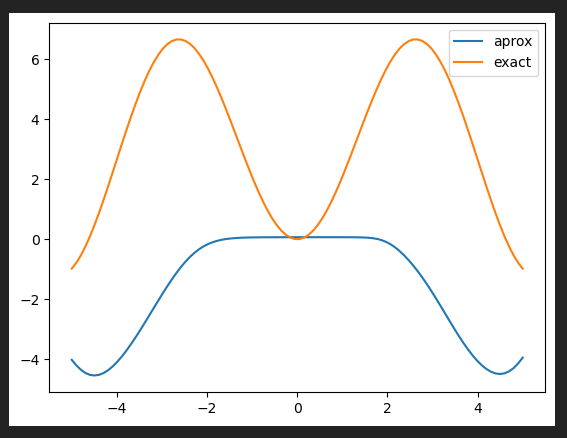

# Reporte

Para las primeras 3 partes de la tarea pude resolver los problemas exitosamente. En la cuarta parte, por otro lado, tengo problemas. No sé con exactitud cuál es mi error pero creo que tal vez puse mal la ecuación diferencial en el modelo. 

Este es el resultado que me da,



Según yo el error o está en la ecuación que introduje en `eq`,

```python 
with tf.GradientTape() as tape:
    tape.watch(x)
    with tf.GradientTape() as tape2:
        tape2.watch(x)
        y_pred = self(x, training=True)
    dy = tape2.gradient(y_pred, x) 
    x_o = tf.zeros((batch_size,1)) 
    y_o = self(x_o,training=True) 
    eq = x*dy + y_pred - tf.math.cos(x)*x**2 # aquí pero no creo
    ic = 0. 
    loss = self.mse(0., eq) + self.mse(y_o, ic)
```

O en mi solución de la ecuación diferencial, que según yo es,

$$
y = \frac{x^2\sin{x} - 2\sin{x}}{x} - 2\cos{x}
$$