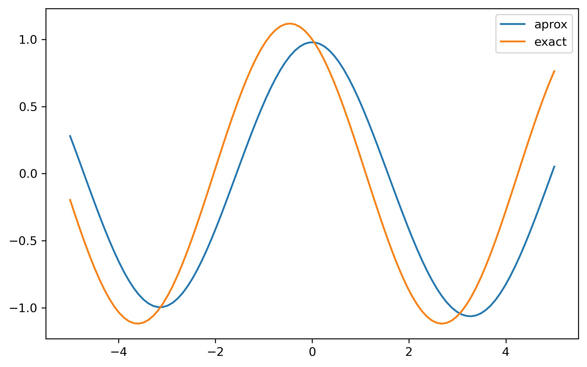

# Reporte

Para las primeras 3 partes de la tarea pude resolver los problemas exitosamente. En la cuarta parte, por otro lado, tuve un ligero problema en la solución de la segunda ecuación diferencial. Tengo un ligero desfase en la solución de la ecuación,



Honestamente no sé cuál fué mi error. Inicialmente intenté, con la siguiente capa,

```python
class ODESolver2(Sequential):
    def __init__(self, **kwargs):
        super().__init__(**kwargs)
        self.loss_tracker = keras.metrics.Mean(name="loss")
        self.mse = tf.keras.losses.MeanSquaredError()

    @property
    def metrics(self):
      return [self.loss_tracker]

    def train_step(self, data):
         batch_size = tf.shape(data)[0]
         min = tf.cast(tf.reduce_min(data),tf.float32)
         max = tf.cast(tf.reduce_max(data),tf.float32)
         x = tf.random.uniform((batch_size, 1), minval=min, maxval=max)

         with tf.GradientTape(persistent=True) as tape:
            tape.watch(x)
            with tf.GradientTape(persistent=True) as g:
                g.watch(x)
                with tf.GradientTape(persistent=True) as gg:
                    gg.watch(x)
                    y_pred = self(x, training=True)
                dy = gg.gradient(y_pred, x)
            ddy = g.gradient(dy, x)
            x_o = tf.zeros((batch_size,1)) 
            y_o1 = self(x_o, training=True)
            y_o2 = self(x_o, training=True)
            eq = ddy + y_pred
            ic1 = 1.
            ic2 = -0.5
            loss = self.mse(0., eq) + self.mse(y_o1, ic1) + self.mse(y_o2, ic2) 

        # Apply grads
         grads = tape.gradient(loss, self.trainable_variables)
         self.optimizer.apply_gradients(zip(grads, self.trainable_variables))
        #update metrics
         self.loss_tracker.update_state(loss)
        # Return a dict mapping metric names to current value
         return {"loss": self.loss_tracker.result()}
```

Pero los resultados no fueron ni cercanos a lo buscado. De ahí, intenté con la modificación del `loss`,

```python
loss = self.mse(0., eq) + self.mse(y_o1, ic1)
```

y

```python
loss = self.mse(0., eq) + self.mse(y_o1, ic2)
```

Y con la primera fue que obtuve el resultado anterior. La solución que encontré a la ecuación diferencial fue, 

$$
y = -0.5\sin{x} + \cos{x} 
$$

También puede ser que ahí esté mi error. Lo que sucede es que no entendí cuál valor inicial de los proporcionados era de $y$ y cuál de $y'$. Asumí que $y(0) = -0.5$.